# Diagrama de Componentes - Sistema Chriska

## Diagrama Mermaid

```mermaid
graph TB
    subgraph AppWeb ["Aplicación Web"]
        App[App Component]
        
        subgraph PaginasPrincipales ["Páginas Principales"]
            LoginPage[Login]
            Dashboard[Dashboard]
            ProductsPage[Gestión de Productos]
            UsersPage[Gestión de Usuarios] 
            ClientsPage[Gestión de Clientes]
            OrdersPage[Gestión de Pedidos]
            DeliveriesPage[Gestión de Entregas]
            InventoryPage[Gestión de Inventario]
            VehiclesPage[Gestión de Vehículos]
            ReportsPage[Reportes]
        end
    end
    
    subgraph CompProductos ["Componentes de Productos"]
        ProductList[ProductList]
        ProductAdd[ProductAdd]
        ProductEdit[ProductEdit]
        ProductDetail[ProductDetail]
        ProductFilters[ProductFilters]
        ProductCard[ProductCard]
        CategorySelect[CategorySelect]
        BrandSelect[BrandSelect]
        ImageUpload[ImageUpload]
    end
    
    subgraph CompUsuarios ["Componentes de Usuarios"]
        UserList[UserList]
        UserAdd[UserAdd] 
        UserEdit[UserEdit]
        UserDetail[UserDetail]
        UserFilters[UserFilters]
        RoleSelect[RoleSelect]
        PermissionMatrix[PermissionMatrix]
        PasswordChange[PasswordChange]
    end
    
    subgraph CompClientes ["Componentes de Clientes"]
        ClientList[ClientList]
        ClientAdd[ClientAdd]
        ClientEdit[ClientEdit]
        ClientDetail[ClientDetail]
        ClientFilters[ClientFilters]
        ClientCard[ClientCard]
        ZoneSelect[ZoneSelect]
        ContactInfo[ContactInfo]
    end
    
    subgraph CompPedidos ["Componentes de Pedidos"]
        OrderList[OrderList]
        OrderAdd[OrderAdd]
        OrderEdit[OrderEdit]
        OrderDetail[OrderDetail]
        OrderFilters[OrderFilters]
        OrderCard[OrderCard]
        ProductSelector[ProductSelector]
        OrderSummary[OrderSummary]
        StatusBadge[StatusBadge]
    end
    
    subgraph CompEntregas ["Componentes de Entregas"]
        DeliveryList[DeliveryList]
        DeliveryDetail[DeliveryDetail]
        DeliveryFilters[DeliveryFilters]
        DeliveryCard[DeliveryCard]
        DeliveryConfirm[DeliveryConfirm]
        DeliveryMap[DeliveryMap]
        VehicleAssign[VehicleAssign]
        RouteOptimizer[RouteOptimizer]
    end
    
    subgraph CompInventario ["Componentes de Inventario"]
        StockMovementList[StockMovementList]
        WarehouseList[WarehouseList]
        ShelfList[ShelfList]
        StockAlert[StockAlert]
        InventoryCard[InventoryCard]
        StockMovementAdd[StockMovementAdd]
        LocationSelector[LocationSelector]
        BatchTracker[BatchTracker]
    end
    
    subgraph CompVehiculos ["Componentes de Vehículos"]
        VehicleList[VehicleList]
        VehicleAdd[VehicleAdd]
        VehicleEdit[VehicleEdit]
        VehicleDetail[VehicleDetail]
        VehicleCard[VehicleCard]
        CostTracker[CostTracker]
        MaintenanceLog[MaintenanceLog]
    end
    
    subgraph CompReportes ["Componentes de Reportes"]
        ReportDashboard[ReportDashboard]
        SalesChart[SalesChart]
        InventoryChart[InventoryChart]
        DeliveryChart[DeliveryChart]
        ReportFilters[ReportFilters]
        ExportButton[ExportButton]
        DateRangePicker[DateRangePicker]
        MetricCard[MetricCard]
    end
    
    subgraph CompCompartidos ["Componentes Compartidos"]
        Layout[Layout]
        Sidebar[Sidebar]
        Header[Header]
        Navbar[Navbar]
        Footer[Footer]
        LoadingSpinner[LoadingSpinner]
        ErrorBoundary[ErrorBoundary]
        Modal[Modal]
        ConfirmDialog[ConfirmDialog]
        Toast[Toast]
        Pagination[Pagination]
        SearchBox[SearchBox]
        DatePicker[DatePicker]
        GenericAdd[GenericAdd]
        GenericDelete[GenericDelete]
        GenericEdit[GenericEdit]
        DataTable[DataTable]
        FormField[FormField]
        ButtonGroup[ButtonGroup]
        Card[Card]
        Badge[Badge]
        Avatar[Avatar]
        Breadcrumb[Breadcrumb]
        UnsavedChangesModal[UnsavedChangesModal]
    end
    
    App --> Layout
    Layout --> Header
    Layout --> Sidebar
    Layout --> Footer
    
    ProductsPage --> ProductList
    ProductsPage --> ProductAdd
    ProductsPage --> ProductFilters
    
    UsersPage --> UserList
    UsersPage --> UserAdd
    UsersPage --> UserFilters
    
    ClientsPage --> ClientList
    ClientsPage --> ClientAdd
    ClientsPage --> ClientFilters
    
    OrdersPage --> OrderList
    OrdersPage --> OrderAdd
    OrdersPage --> OrderFilters
    
    DeliveriesPage --> DeliveryList
    DeliveriesPage --> DeliveryConfirm
    DeliveriesPage --> DeliveryFilters
    
    ProductList --> DataTable
    ProductList --> SearchBox
    ProductList --> Pagination
    ProductAdd --> Modal
    ProductAdd --> FormField
    
    UserList --> DataTable
    UserAdd --> Modal
    
    ClientList --> DataTable
    ClientAdd --> Modal
    
    OrderList --> DataTable
    OrderAdd --> Modal
    
    DeliveryList --> DataTable
    DeliveryConfirm --> Modal
    
    classDef page fill:#e3f2fd
    classDef component fill:#f3e5f5
    classDef shared fill:#e8f5e8
    
    class App,PaginasPrincipales page
    class CompProductos,CompUsuarios,CompClientes,CompPedidos,CompEntregas,CompInventario,CompVehiculos,CompReportes component
    class CompCompartidos shared
```



## Cómo convertir a imagen:

1. **Copiar el código Mermaid** (desde ```mermaid hasta ```)
2. **Ir a [mermaid.live](https://mermaid.live)**
3. **Pegar el código** en el editor
4. **Descargar como PNG/SVG** usando el botón "Download"

## Descripción de Componentes:

### Frontend (Next.js 15)
- **App Router**: Sistema de enrutamiento de Next.js 15
- **Components**: Organizados por feature con componentes compartidos
- **Zustand**: Manejo de estado global, especialmente autenticación
- **Services**: Capa de servicios para comunicación con API
- **Custom Hooks**: Hooks personalizados para lógica reutilizable

### Backend (.NET 8)
- **Controllers**: Endpoints REST organizados por dominio
- **Business Logic**: Lógica de negocio separada de controladores
- **Data Access**: Acceso a datos sin Entity Framework
- **Middleware**: JWT, CORS, manejo de errores

### Database (SQL Server)
- **Core Tables**: Tablas principales del dominio
- **Audit**: Logs de auditoría y movimientos de stock

### Servicios Externos
- **Azure Blob**: Almacenamiento de imágenes
- **MapLibre**: Mapas interactivos
- **PMTiles**: Datos geográficos eficientes

### Infraestructura Cloud
- **Vercel**: Hosting del frontend
- **Azure**: Backend, base de datos y storage